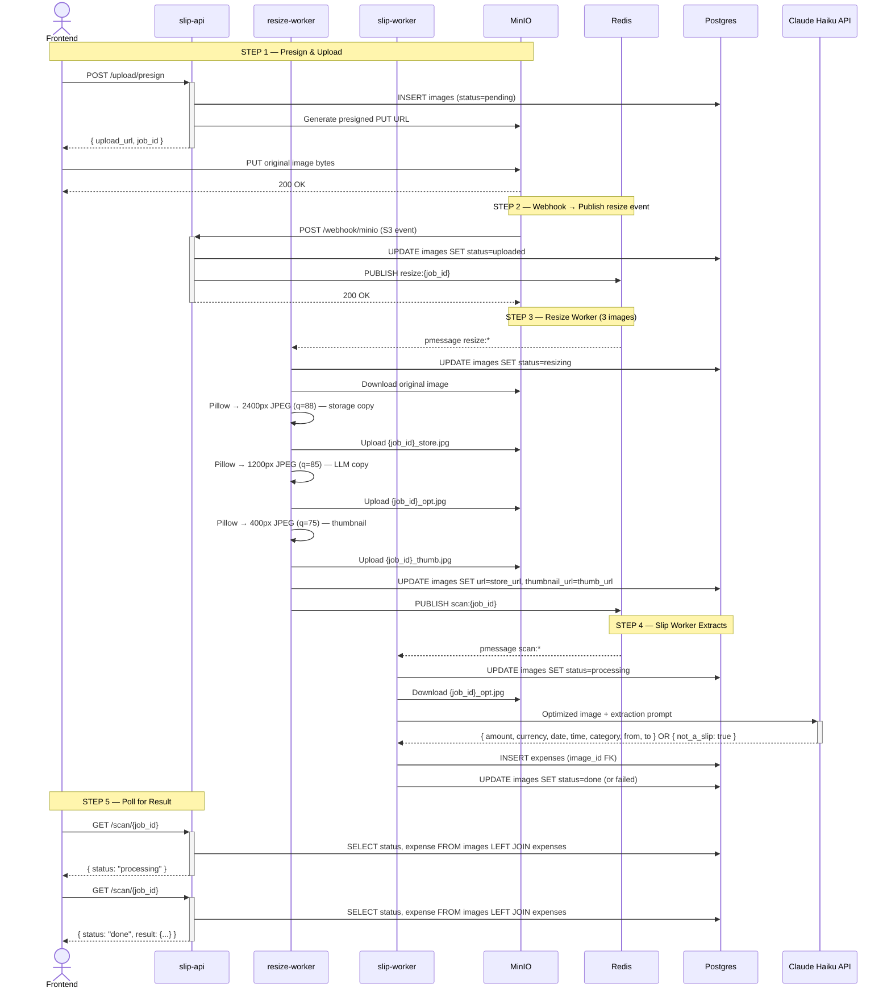

# CLAUDE.md — หมาจด / WoofJot POC

## Goal

Proof of concept. Validate that Claude Vision can reliably extract amount
and date from Thai bank slips. Runs entirely via Docker Compose. Stack is
production-shaped — replacing any component later is an env var change,
not a rewrite.

## Upload and scan flow



**Key points:**
- `images.status` is the single source of truth for scan lifecycle
- Redis is used exclusively as an event bus (PUBLISH/SUBSCRIBE) — no state stored
- `GET /scan/{job_id}` queries Postgres directly — simple and always consistent
- Frontend PUTs directly to MinIO — no service ever handles image bytes in the request cycle
- Three MinIO objects are created per upload:
  - `{job_id}.{ext}` — raw upload (only used until resize completes, then superseded)
  - `{job_id}_store.jpg` — high-quality storage copy (2400px, q=88); `images.url` is updated to this after resize
  - `{job_id}_opt.jpg` — LLM-optimized copy (1200px, q=85); sent to Claude, never shown in UI
  - `{job_id}_thumb.jpg` — thumbnail (400px, q=75); stored in `images.thumbnail_url`, shown in UI
- `_store`, `_opt`, `_thumb` suffixes ensure `key.rsplit(".", 1)[0]` never matches an `images` row — webhook ignores them, preventing a resize/scan loop
- `expenses` row is only created after successful Claude extraction

## Stack

```
Frontend       Next.js 14 (App Router) — port 3000
slip-api       FastAPI (Python 3.11) — port 8000  (presign, webhook, scan poll)
expenses-api   FastAPI (Python 3.11) — port 8001  (expense CRUD)
resize-worker  Python async — Pillow resize → MinIO → Redis scan:*
slip-worker    Python async — Claude Haiku extraction → Postgres
Blob storage   MinIO (S3-compatible) — port 9000 / console 9001
Event bus      Redis pub/sub — port 6379  (publish/subscribe only, no state)
Database       PostgreSQL 16 — port 5432  (all state lives here)
AI             Anthropic Claude Vision API (claude-haiku-4-5-20251001)
Runtime        Docker Compose
```

No external services. Everything runs locally with one command.

## Repository structure

```
/
├── frontend/
│   ├── app/
│   │   ├── page.tsx
│   │   └── layout.tsx
│   ├── components/
│   │   ├── SlipUploader.tsx      # presign → PUT → poll flow
│   │   ├── ScanStatus.tsx        # polls GET /scan/{job_id}
│   │   ├── ExpenseList.tsx       # expense list grouped by month
│   │   └── MonthlySummary.tsx    # monthly total + category breakdown
│   ├── lib/
│   │   ├── api.ts                # all backend fetch calls
│   │   └── types.ts              # shared TypeScript interfaces
│   ├── Dockerfile
│   └── next.config.ts
│
├── backend/
│   ├── sync/
│   │   ├── slip/                 # slip-api — port 8000
│   │   │   ├── routers/
│   │   │   │   ├── upload.py     # POST /upload/presign
│   │   │   │   ├── webhook.py    # POST /webhook/minio → PUBLISH resize:{job_id}
│   │   │   │   └── scan.py       # GET /scan/{job_id}
│   │   │   ├── db.py             # insert_image, transition_to_uploaded, get_scan_status
│   │   │   ├── storage.py        # presigned PUT URL + object_url
│   │   │   ├── pubsub.py         # publish only
│   │   │   ├── models.py         # Pydantic schemas
│   │   │   ├── config.py
│   │   │   ├── main.py
│   │   │   ├── requirements.txt
│   │   │   └── Dockerfile
│   │   │
│   │   └── expenses/             # expenses-api — port 8001
│   │       ├── db.py             # get_expenses, update_expense, delete_image_by_expense_id
│   │       ├── models.py
│   │       ├── config.py
│   │       ├── main.py
│   │       ├── requirements.txt
│   │       └── Dockerfile
│   │
│   └── async/
│       ├── resize/               # resize-worker — subscribes to resize:*
│       │   ├── resizer.py        # Pillow → 3 images (_store, _opt, _thumb) → PUBLISH scan:{job_id}
│       │   ├── storage.py        # download + upload + object_url
│       │   ├── pubsub.py         # subscribe resize:* + publish scan:*
│       │   ├── db.py             # update_image_status, update_image_urls
│       │   ├── config.py
│       │   ├── worker.py
│       │   ├── requirements.txt
│       │   └── Dockerfile
│       │
│       └── slip/                 # slip-worker — subscribes to scan:*
│           ├── claude.py         # extract_slip + process_scan
│           ├── storage.py        # download only
│           ├── pubsub.py         # subscribe scan:*
│           ├── db.py             # update_image_status, get_image_id, insert_expense
│           ├── config.py
│           ├── worker.py
│           ├── requirements.txt
│           └── Dockerfile
│
├── docker-compose.yml
├── .env
├── .env.example
└── CLAUDE.md
```

**Rule: no shared files across services.** Each service owns its own copy of db.py, config.py, storage.py, etc. — scoped to only what that service needs.

## Running locally

```bash
cp .env.example .env
# edit .env — set ANTHROPIC_API_KEY, rest have working defaults

docker compose up --build

# Frontend:            http://localhost:3000
# slip-api docs:       http://localhost:8000/docs
# expenses-api docs:   http://localhost:8001/docs
# MinIO console:       http://localhost:9001  (minioadmin / minioadmin)
```

## Environment variables

```bash
# .env (project root)
ANTHROPIC_API_KEY=sk-ant-...

# MinIO
MINIO_ENDPOINT=minio:9000
MINIO_EXTERNAL_ENDPOINT=localhost:9000   # used for presigned URLs (browser-accessible)
MINIO_ACCESS_KEY=minioadmin
MINIO_SECRET_KEY=minioadmin
MINIO_BUCKET=slips
MINIO_USE_SSL=false

# Redis
REDIS_URL=redis://redis:6379/0

# PostgreSQL
POSTGRES_HOST=postgres
POSTGRES_PORT=5432
POSTGRES_DB=woofjot
POSTGRES_USER=woofjot
POSTGRES_PASSWORD=woofjot

# Webhook
WEBHOOK_SECRET=changeme

# Resize tuning (resize-worker)
RESIZE_MAX_PX=1200          # LLM-optimised copy max dimension
RESIZE_QUALITY=85           # LLM-optimised copy JPEG quality
RESIZE_STORE_MAX_PX=2400    # Storage-optimised original max dimension
RESIZE_STORE_QUALITY=88     # Storage-optimised original JPEG quality
RESIZE_THUMB_MAX_PX=400     # Thumbnail max dimension
RESIZE_THUMB_QUALITY=75     # Thumbnail JPEG quality

# Claude model (slip-worker)
CLAUDE_MODEL=claude-haiku-4-5-20251001

# Frontend
NEXT_PUBLIC_SLIP_API_URL=http://localhost:8000
NEXT_PUBLIC_EXPENSES_API_URL=http://localhost:8001
```

## PostgreSQL schema

```sql
-- Image upload metadata and scan lifecycle
CREATE TABLE IF NOT EXISTS images (
  id              SERIAL PRIMARY KEY,
  job_id          TEXT NOT NULL UNIQUE,
  storage_key     TEXT NOT NULL,              -- MinIO key of the LLM-optimised copy e.g. "abc123_opt.jpg"
  url             TEXT NOT NULL,              -- MinIO URL of storage copy (_store.jpg) — updated by resize-worker
  thumbnail_url   TEXT,                       -- MinIO URL of thumbnail (_thumb.jpg) — populated by resize-worker
  original_name   TEXT,                       -- original filename from client
  mime_type       TEXT,                       -- e.g. "image/jpeg"
  size_bytes      BIGINT,                     -- populated from webhook S3 event
  status          TEXT NOT NULL DEFAULT 'pending',
  error           TEXT,                       -- populated if status = failed
  created_at      TIMESTAMPTZ DEFAULT now(),
  updated_at      TIMESTAMPTZ DEFAULT now()
);

-- status lifecycle:
--   pending    → INSERT in /upload/presign
--   uploaded   → UPDATE in /webhook/minio (confirmed in storage)
--   resizing   → UPDATE when resize-worker starts
--   processing → UPDATE when slip-worker starts Claude call
--   done       → UPDATE after expense inserted successfully
--   failed     → UPDATE if any step throws

-- Expense extracted from slip image
CREATE TABLE IF NOT EXISTS expenses (
  id          SERIAL PRIMARY KEY,
  image_id    INTEGER NOT NULL REFERENCES images(id) ON DELETE CASCADE,
  amount      NUMERIC(12, 2),
  currency    TEXT DEFAULT 'THB',
  date        DATE,
  time        TIME,
  category    TEXT,                           -- user fills in post-scan
  note        TEXT,                           -- user fills in post-scan
  raw_text    TEXT,
  created_at  TIMESTAMPTZ DEFAULT now(),
  updated_at  TIMESTAMPTZ DEFAULT now()
);

CREATE INDEX IF NOT EXISTS idx_images_job_id ON images(job_id);
CREATE INDEX IF NOT EXISTS idx_images_status ON images(status);
CREATE INDEX IF NOT EXISTS idx_expenses_date ON expenses(date DESC);
```

**Design rules:**
- `images.status` is the only source of truth — never duplicate state elsewhere
- `expenses` is only inserted on `status=done` — never before
- `ON DELETE CASCADE` means deleting an image cleans up its expense automatically
- `size_bytes` and `mime_type` come from the MinIO S3 event — never trust the client for these
- `images.url` initially points to the raw upload; resize-worker updates it to `_store.jpg` (high-quality compressed)
- `images.thumbnail_url` is `null` until resize-worker populates it with the `_thumb.jpg` URL
- `images.storage_key` points to the LLM-optimised copy (`_opt.jpg`) used for Claude extraction

## API endpoints

### slip-api (port 8000)

#### POST /upload/presign

Request:
```json
{ "filename": "slip.jpg", "content_type": "image/jpeg" }
```

Response:
```json
{
  "upload_url": "http://localhost:9000/slips/abc123.jpg?X-Amz-...",
  "key": "abc123.jpg",
  "job_id": "abc123",
  "expires_in": 900
}
```

- Generates `key` as `{uuid4}.{ext}` — never use original filename as key
- `job_id` = key without extension: `key.rsplit(".", 1)[0]`
- INSERTs `images` row with `status=pending`; `url` = object_url of original key
- Presigned URL uses `MINIO_EXTERNAL_ENDPOINT` (browser-reachable)

#### POST /webhook/minio

Validates bearer token, updates `images.status` to `uploaded`, publishes to `resize:{job_id}`.
Returns 200 immediately — never does slow work here.

```python
job_id = key.rsplit(".", 1)[0]
updated = await db.transition_image_to_uploaded(conn, job_id, size_bytes=size_bytes)
if updated:
    await pubsub.publish(f"resize:{job_id}", {"key": key, "job_id": job_id})
```

Only publishes if status was `pending` — duplicate webhook events are silently ignored.

#### GET /health

```json
{ "status": "ok" }
```

#### GET /scan/{job_id}

Queries Postgres directly — no Redis read.

Response shape by status:

```json
{ "job_id": "abc123", "status": "pending" }
{ "job_id": "abc123", "status": "uploaded" }
{ "job_id": "abc123", "status": "resizing" }
{ "job_id": "abc123", "status": "processing" }
{
  "job_id": "abc123",
  "status": "done",
  "result": {
    "expense_id": 1,
    "image_id": 1,
    "image_url": "http://localhost:9000/slips/abc123_store.jpg",
    "thumbnail_url": "http://localhost:9000/slips/abc123_thumb.jpg",
    "amount": 1500.00,
    "currency": "THB",
    "date": "2026-03-29",
    "time": "14:32:00"
  }
}
{ "job_id": "abc123", "status": "failed", "error": "..." }
```

### expenses-api (port 8001)

#### GET /expenses?month=YYYY-MM&sort=date|uploaded

Required query params:
- `month` — calendar month to filter, e.g. `2026-04`
- `sort` — `date` (default) or `uploaded`

`sort=date`: filters by `e.date` month, orders by `e.date DESC NULLS LAST, e.created_at DESC`  
`sort=uploaded`: filters by `e.created_at` month (UTC), orders by `e.created_at DESC`

All filtering and ordering happens in SQL — the frontend receives only the rows it needs.

```json
[
  {
    "id": 1,
    "image_id": 1,
    "image_url": "http://localhost:9000/slips/abc123_store.jpg",
    "thumbnail_url": "http://localhost:9000/slips/abc123_thumb.jpg",
    "amount": 1500.00,
    "currency": "THB",
    "date": "2026-03-29",
    "time": "14:32:00",
    "category": "food",
    "sender": "Somchai K.",
    "receiver": "Coffee Shop Co., Ltd.",
    "note": "lunch",
    "created_at": "2026-03-29T14:32:00Z"
  }
]
```

#### PATCH /expenses/{id}

All fields are optional. Only provided fields are updated.

```json
{
  "amount": 1500.00,
  "date": "2026-03-29",
  "time": "14:32:00",
  "sender": "Somchai K.",
  "receiver": "Coffee Shop Co., Ltd.",
  "category": "food",
  "note": "lunch with team"
}
```

#### DELETE /expenses/{id}

Deletes the `images` row — CASCADE removes the linked expense.

## resize-worker: process_resize

File: `backend/async/resize/resizer.py`

```python
async def process_resize(key: str, job_id: str, db_pool) -> str | None:
    # 1. Mark resizing
    await db.update_image_status(conn, job_id, "resizing")

    # 2. Download original from MinIO
    original_bytes = await storage.download(key)

    # 3. Storage-optimised copy → {job_id}_store.jpg (2400px, q=88)
    store_bytes = _resize_bytes(original_bytes, settings.resize_store_max_px, settings.resize_store_quality)
    store_key = f"{job_id}_store.jpg"
    await storage.upload(store_key, store_bytes, "image/jpeg")
    store_url = storage.object_url(store_key)

    # 4. LLM-optimised copy → {job_id}_opt.jpg (1200px, q=85)
    opt_bytes = _resize_bytes(original_bytes, settings.resize_max_px, settings.resize_quality)
    opt_key = f"{job_id}_opt.jpg"
    await storage.upload(opt_key, opt_bytes, "image/jpeg")

    # 5. Thumbnail → {job_id}_thumb.jpg (400px, q=75)
    thumb_bytes = _resize_bytes(original_bytes, settings.resize_thumb_max_px, settings.resize_thumb_quality)
    thumb_key = f"{job_id}_thumb.jpg"
    await storage.upload(thumb_key, thumb_bytes, "image/jpeg")
    thumb_url = storage.object_url(thumb_key)

    # 6. Update images.url → store URL, images.thumbnail_url → thumb URL
    await db.update_image_urls(conn, job_id, url=store_url, thumbnail_url=thumb_url)

    return opt_key  # caller publishes scan:{job_id} with this key
```

## slip-worker: process_scan

File: `backend/async/slip/claude.py`

```python
async def process_scan(key: str, job_id: str, db_pool) -> None:
    # 1. Mark processing
    await db.update_image_status(conn, job_id, "processing")

    # 2. Download optimized image from MinIO
    image_bytes = await storage.download(key)  # key = {job_id}_opt.jpg

    # 3. Call Claude Haiku — raises ValueError("not_a_slip") if image is not a slip
    result = await extract_slip(image_bytes, media_type)

    # 4. Persist to Postgres
    image_id = await db.get_image_id(conn, job_id)
    await db.insert_expense(conn, image_id, result)
    await db.update_image_status(conn, job_id, "done")

    # ValueError("not_a_slip") → status=failed, error="ไม่พบสลิปธนาคารในภาพนี้"
    # Other exceptions     → status=failed, error=str(e)
```

Claude extraction prompt — do not change without testing on real slips:

```
Look at this image. If it is NOT a Thai bank transfer slip or payment receipt,
return exactly this JSON with no other text:
{"not_a_slip": true}

If it IS a Thai bank transfer slip, extract the following fields and return ONLY
a JSON object with no extra text, preamble, or markdown fences:

{
  "amount": <number only, no commas or currency symbol>,
  "currency": "THB",
  "date": <YYYY-MM-DD, convert Buddhist Era to CE>,
  "time": <HH:MM:SS or null>,
  "category": <one of: food, transport, shopping, utilities, health, entertainment, invest, other — infer from merchant name, description, or context; null if cannot determine>,
  "from": <sender name or account holder name; null if not found>,
  "to": <recipient name or merchant name; null if not found>,
  "raw_text": <all visible text as a single string>
}

Category hints:
- food: restaurants, cafes, food delivery, convenience stores, supermarkets
- transport: fuel, BTS/MRT, taxis, Grab, tolls, parking, airlines, buses
- shopping: clothing, electronics, department stores, online shopping
- utilities: electricity, water, internet, phone top-up, insurance
- health: hospitals, pharmacies, clinics, gyms
- entertainment: cinemas, streaming, games, events
- invest: stocks, mutual funds, crypto, brokerage transfers, savings deposits

If a field cannot be found, set it to null.
```

`extract_slip` parses the JSON. If `result.get("not_a_slip")` is true it raises `ValueError("not_a_slip")`. `process_scan` catches this sentinel and stores a Thai-language error message. All other exceptions store the raw error string.

## Frontend: upload flow

```
1. User selects file
2. POST /upload/presign  → { upload_url, key, job_id }
3. PUT file bytes to upload_url  (raw bytes, not FormData)
4. Start polling GET /scan/{job_id} every 2 seconds
5. Show Thai status label per response status:
     pending    → "รอการอัปโหลด..."
     uploaded   → "อัปโหลดสำเร็จ กำลังเตรียม..."
     resizing   → "กำลังปรับขนาดรูปภาพ..."
     processing → "กำลังประมวลผล..."
     done       → "เสร็จสิ้น"
     failed     → show data.error verbatim (e.g. "ไม่พบสลิปธนาคารในภาพนี้")
6. On "done"   → show result, prompt for category + note → PATCH /expenses/{id}
7. On "failed" → show error message, allow retry
```

- Use raw `fetch` with `method: "PUT"` and `body: file` for MinIO upload
- Do not use `FormData` for the PUT — presigned URLs expect raw bytes
- Timeout polling after 30 attempts (60 seconds)

## Frontend: expense list

- Expenses are fetched with `GET /expenses?month=YYYY-MM&sort=date|uploaded`
- Sort preference is persisted in `localStorage` under key `"sort"`
- On mount, `useEffect` reads localStorage and sets `sort` state, then sets `sortReady=true`
- The fetch is gated behind `sortReady` so exactly one request fires with the correct sort value — avoids a double-fetch when localStorage value differs from the React default
- The sort toggle stays visually neutral (`sortReady && sort === s`) until localStorage is confirmed, preventing a flash from the default to the saved value
- While loading, skeleton placeholders replace the header total, MonthlySummary donut, and expense rows

## Expense categories

```
food          อาหาร
transport     เดินทาง
shopping      ช้อปปิ้ง
utilities     ค่าน้ำค่าไฟ
health        สุขภาพ
entertainment บันเทิง
invest        ลงทุน
other         อื่นๆ
```

## CORS

Both FastAPI services apply the same CORS policy:

```python
app.add_middleware(
    CORSMiddleware,
    allow_origins=["http://localhost:3000"],
    allow_methods=["*"],
    allow_headers=["*"],
)
```

## Thai bank slip notes

Claude Vision handles these banks reliably:
- KBank (ธนาคารกสิกรไทย), SCB (ธนาคารไทยพาณิชย์), KTB (ธนาคารกรุงไทย)
- BBL (ธนาคารกรุงเทพ), TTB (ธนาคารทหารไทยธนชาต)
- PromptPay QR receipts (all banks)

Dates may use Buddhist Era (BE 2569 = CE 2026). Prompt instructs Claude
to convert — do not post-process dates manually.

## Code style

- Python: type hints everywhere, Pydantic v2 for all schemas, no ORM
- TypeScript: strict mode, no `any`
- React: functional components only
- `ANTHROPIC_API_KEY` in async/slip only — never in sync services or frontend
- Webhook handler returns 200 immediately — no slow work in the handler
- Redis is pub/sub only — if you find yourself calling `redis.get/set`, stop
- No shared files across services — each service is self-contained
- Tailwind: use semantic color tokens from `tailwind.config.ts`, never inline `[#HEX]` bracket values in class strings. Token palette: `page`, `surface`, `elevated`, `lift`, `line`, `muted`, `subtle`, `faint`, `accent`

## Docker services summary

| Service      | Image              | Port        | Role                                    |
|--------------|--------------------|-------------|-----------------------------------------|
| frontend     | custom (node:20)   | 3000        | Next.js web app                         |
| slip-api     | custom (py:3.11)   | 8000        | Presign, webhook, scan poll             |
| expenses-api | custom (py:3.11)   | 8001        | Expense CRUD                            |
| resize-worker| custom (py:3.11)   | —           | Pillow resize, publishes to scan:*      |
| slip-worker  | custom (py:3.11)   | —           | Claude Haiku extraction                 |
| postgres     | postgres:16-alpine | 5432        | All state (images + expenses)           |
| redis        | redis:7-alpine     | 6379        | Event bus only (pub/sub)                |
| minio        | minio/minio        | 9000 / 9001 | Blob storage + webhooks                 |
| minio-init   | minio/mc           | —           | Bucket + event setup                    |

## Moving to production later

| POC component             | Production replacement                   |
|---------------------------|------------------------------------------|
| MinIO                     | AWS S3 or GCS (env var swap only)        |
| Redis pub/sub (Docker)    | AWS ElastiCache / Upstash Redis          |
| Async workers (Docker)    | Celery, ARQ, or AWS Lambda + SQS         |
| PostgreSQL (Docker)       | AWS RDS / Supabase PostgreSQL            |
| No auth                   | Supabase Auth (LINE + Google)            |
| HTTP webhook              | S3 Event Notifications → SNS → SQS      |

## What not to build in the POC

- User accounts or login
- Payment integration
- PWA / service worker
- Export features
- Admin panel
- Dead letter queue for failed jobs
- Database migration tool (run schema in lifespan)
- Webhook signature verification beyond bearer token
