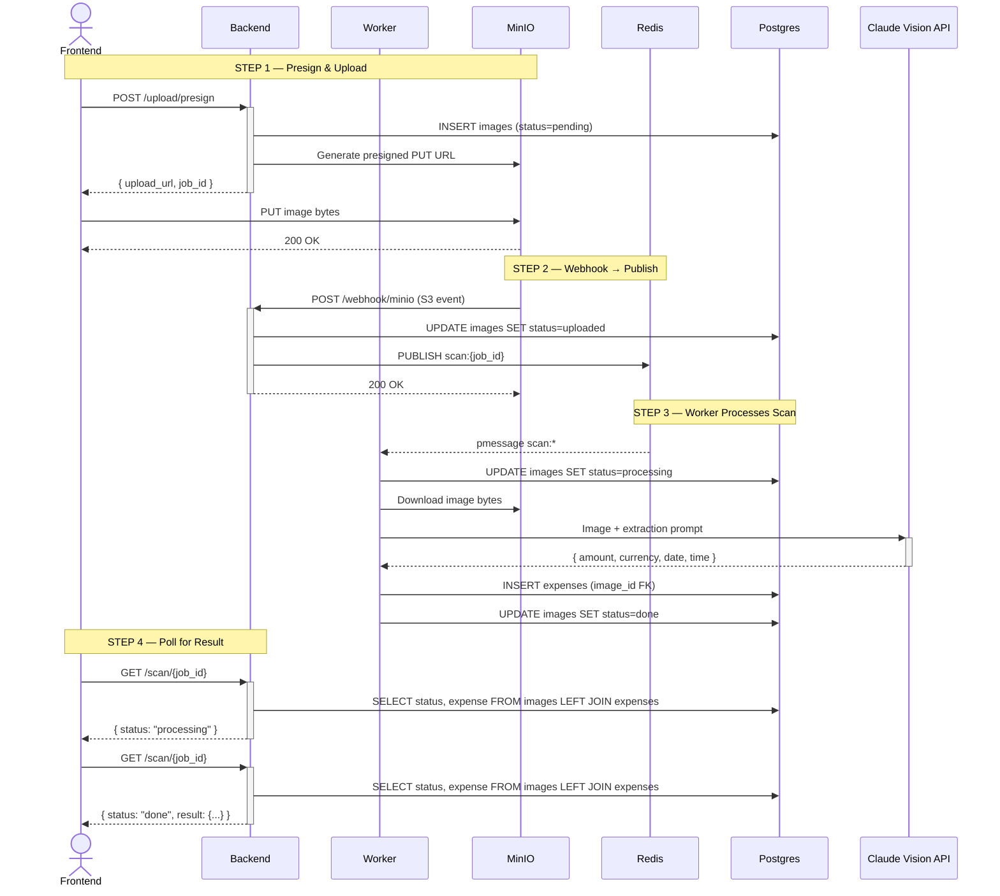

# CLAUDE.md — หมาจด / WoofJot POC

## Goal

Proof of concept. Validate that Claude Vision can reliably extract amount
and date from Thai bank slips. Runs entirely via Docker Compose. Stack is
production-shaped — replacing any component later is an env var change,
not a rewrite.

## Upload and scan flow



**Key points:**
- `images.status` in Postgres is the single source of truth for scan lifecycle
- Redis is used exclusively as an event bus (PUBLISH/SUBSCRIBE) — no state stored
- `job_store.py` does not exist — no Redis GET/SET for job state
- `GET /scan/{job_id}` queries Postgres directly — simple and always consistent
- Frontend PUTs directly to MinIO — backend never handles image bytes in the request cycle
- `expenses` row is only created after successful Claude extraction

## Stack

```
Frontend      Next.js 14 (App Router) — port 3000
Backend       FastAPI (Python 3.11) — port 8000
Blob storage  MinIO (S3-compatible) — port 9000 / console 9001
Event bus     Redis pub/sub — port 6379  (publish/subscribe only, no state)
Database      PostgreSQL 16 — port 5432  (all state lives here)
AI            Anthropic Claude Vision API (claude-opus-4-5)
Worker        Async task inside FastAPI process (subscribes to Redis)
Runtime       Docker Compose
```

No external services. Everything runs locally with one command.

## Repository structure

```
/
├── frontend/
│   ├── app/
│   │   ├── page.tsx
│   │   └── layout.tsx
│   ├── components/
│   │   ├── SlipUploader.tsx      # presign → PUT → poll flow
│   │   ├── ScanStatus.tsx        # polls GET /scan/{job_id}
│   │   ├── ExpenseList.tsx       # expense list grouped by month
│   │   └── MonthlySummary.tsx    # monthly total + category breakdown
│   ├── lib/
│   │   ├── api.ts                # all backend fetch calls
│   │   └── types.ts              # shared TypeScript interfaces
│   ├── Dockerfile
│   └── next.config.ts
│
├── backend/
│   ├── main.py                   # FastAPI app, lifespan, middleware
│   ├── routers/
│   │   ├── upload.py             # POST /upload/presign
│   │   ├── webhook.py            # POST /webhook/minio
│   │   ├── scan.py               # GET /scan/{job_id}
│   │   └── expenses.py           # GET/PATCH/DELETE /expenses
│   ├── services/
│   │   ├── storage.py            # MinIO / S3 client (boto3)
│   │   ├── claude.py             # Claude Vision wrapper + process_scan
│   │   ├── pubsub.py             # Redis PUBLISH + subscriber loop
│   │   └── db.py                 # asyncpg pool + all queries
│   ├── models.py                 # Pydantic schemas
│   ├── requirements.txt
│   └── Dockerfile
│
├── docker-compose.yml
├── .env
├── .env.example
└── CLAUDE.md
```

Note: `job_store.py` does not exist. There is no Redis state management.

## Running locally

```bash
cp .env.example .env
# edit .env — set ANTHROPIC_API_KEY, rest have working defaults

docker compose up --build

# Frontend:       http://localhost:3000
# Backend:        http://localhost:8000
# API docs:       http://localhost:8000/docs
# MinIO console:  http://localhost:9001  (minioadmin / minioadmin)
```

## Environment variables

```bash
# .env (project root)
ANTHROPIC_API_KEY=sk-ant-...

# MinIO
MINIO_ENDPOINT=minio:9000
MINIO_EXTERNAL_ENDPOINT=localhost:9000   # used for presigned URLs (browser-accessible)
MINIO_ACCESS_KEY=minioadmin
MINIO_SECRET_KEY=minioadmin
MINIO_BUCKET=slips
MINIO_USE_SSL=false

# Redis
REDIS_URL=redis://redis:6379/0

# PostgreSQL
POSTGRES_HOST=postgres
POSTGRES_PORT=5432
POSTGRES_DB=woofjot
POSTGRES_USER=woofjot
POSTGRES_PASSWORD=woofjot

# Webhook
WEBHOOK_SECRET=changeme

# frontend/.env.local
NEXT_PUBLIC_API_URL=http://localhost:8000
```

## docker-compose.yml

```yaml
services:
  postgres:
    image: postgres:16-alpine
    ports:
      - "5432:5432"
    environment:
      POSTGRES_DB: woofjot
      POSTGRES_USER: woofjot
      POSTGRES_PASSWORD: woofjot
    volumes:
      - postgres_data:/var/lib/postgresql/data
    healthcheck:
      test: ["CMD-SHELL", "pg_isready -U woofjot"]
      interval: 5s
      timeout: 5s
      retries: 5

  redis:
    image: redis:7-alpine
    ports:
      - "6379:6379"
    volumes:
      - redis_data:/data
    healthcheck:
      test: ["CMD", "redis-cli", "ping"]
      interval: 5s
      timeout: 5s
      retries: 5

  minio:
    image: minio/minio
    command: server /data --console-address ":9001"
    ports:
      - "9000:9000"
      - "9001:9001"
    environment:
      MINIO_ROOT_USER: minioadmin
      MINIO_ROOT_PASSWORD: minioadmin
      MINIO_NOTIFY_WEBHOOK_ENABLE_BACKEND: "on"
      MINIO_NOTIFY_WEBHOOK_ENDPOINT_BACKEND: "http://backend:8000/webhook/minio"
      MINIO_NOTIFY_WEBHOOK_AUTH_TOKEN_BACKEND: "Bearer ${WEBHOOK_SECRET}"
    volumes:
      - minio_data:/data
    healthcheck:
      test: ["CMD", "curl", "-f", "http://localhost:9000/minio/health/live"]
      interval: 5s
      timeout: 5s
      retries: 5

  minio-init:
    image: minio/mc
    depends_on:
      minio:
        condition: service_healthy
      backend:
        condition: service_healthy
    entrypoint: >
      /bin/sh -c "
        mc alias set local http://minio:9000 minioadmin minioadmin &&
        mc mb --ignore-existing local/slips &&
        mc event add local/slips arn:minio:sqs::BACKEND:webhook --event put --ignore-existing
      "

  backend:
    build: ./backend
    ports:
      - "8000:8000"
    env_file:
      - .env
    depends_on:
      postgres:
        condition: service_healthy
      redis:
        condition: service_healthy
      minio:
        condition: service_healthy
    volumes:
      - ./backend:/app
    healthcheck:
      test: ["CMD", "curl", "-f", "http://localhost:8000/health"]
      interval: 5s
      timeout: 5s
      retries: 10

  frontend:
    build: ./frontend
    ports:
      - "3000:3000"
    environment:
      - NEXT_PUBLIC_API_URL=http://localhost:8000
    depends_on:
      - backend
    volumes:
      - ./frontend:/app
      - /app/node_modules

volumes:
  postgres_data:
  redis_data:
  minio_data:
```

## PostgreSQL schema

```sql
-- Image upload metadata and scan lifecycle
CREATE TABLE IF NOT EXISTS images (
  id              SERIAL PRIMARY KEY,
  job_id          TEXT NOT NULL UNIQUE,
  storage_key     TEXT NOT NULL,              -- MinIO object key e.g. "abc123.jpg"
  url             TEXT NOT NULL,              -- MinIO URL for display in UI
  original_name   TEXT,                       -- original filename from client
  mime_type       TEXT,                       -- e.g. "image/jpeg"
  size_bytes      BIGINT,                     -- populated from webhook S3 event
  status          TEXT NOT NULL DEFAULT 'pending',
  error           TEXT,                       -- populated if status = failed
  created_at      TIMESTAMPTZ DEFAULT now(),
  updated_at      TIMESTAMPTZ DEFAULT now()
);

-- status lifecycle:
--   pending    → INSERT in /upload/presign
--   uploaded   → UPDATE in /webhook/minio (confirmed in storage)
--   processing → UPDATE when worker starts Claude call
--   done       → UPDATE after expense inserted successfully
--   failed     → UPDATE if any step throws

-- Expense extracted from slip image
CREATE TABLE IF NOT EXISTS expenses (
  id          SERIAL PRIMARY KEY,
  image_id    INTEGER NOT NULL REFERENCES images(id) ON DELETE CASCADE,
  amount      NUMERIC(12, 2),
  currency    TEXT DEFAULT 'THB',
  date        DATE,
  time        TIME,
  category    TEXT,                           -- user fills in post-scan
  note        TEXT,                           -- user fills in post-scan
  raw_text    TEXT,
  created_at  TIMESTAMPTZ DEFAULT now(),
  updated_at  TIMESTAMPTZ DEFAULT now()
);

CREATE INDEX IF NOT EXISTS idx_images_job_id ON images(job_id);
CREATE INDEX IF NOT EXISTS idx_images_status ON images(status);
CREATE INDEX IF NOT EXISTS idx_expenses_date ON expenses(date DESC);
```

**Design rules:**
- `images.status` is the only source of truth — never duplicate state elsewhere
- `expenses` is only inserted on `status=done` — never before
- `ON DELETE CASCADE` means deleting an image cleans up its expense automatically
- `size_bytes` and `mime_type` come from the MinIO S3 event — never trust the client for these

## API endpoints

### POST /upload/presign

Request:
```json
{ "filename": "slip.jpg", "content_type": "image/jpeg" }
```

Response:
```json
{
  "upload_url": "http://localhost:9000/slips/abc123.jpg?X-Amz-...",
  "key": "abc123.jpg",
  "job_id": "abc123",
  "expires_in": 900
}
```

- Generates `key` as `{uuid4}.{ext}` — never use original filename as key
- `job_id` = key without extension: `key.rsplit(".", 1)[0]`
- INSERTs `images` row with `status=pending`
- Presigned URL uses `MINIO_EXTERNAL_ENDPOINT` (browser-reachable)

### POST /webhook/minio

Validates bearer token, updates `images.status` to `uploaded`, publishes
to Redis. Returns 200 immediately — never does slow work here.

```python
if request.headers.get("Authorization") != f"Bearer {settings.WEBHOOK_SECRET}":
    raise HTTPException(403)

record = payload["Records"][0]["s3"]["object"]
key = record["key"]
job_id = key.rsplit(".", 1)[0]

async with app.state.db.acquire() as conn:
    await db.update_image_status(
        conn, job_id, "uploaded", size_bytes=record["size"]
    )

await pubsub.publish(f"scan:{job_id}", {"key": key, "job_id": job_id})
return {"ok": True}
```

### GET /health

```json
{ "status": "ok" }
```

### GET /scan/{job_id}

Queries Postgres directly — no Redis read.

```python
async with app.state.db.acquire() as conn:
    row = await db.get_scan_status(conn, job_id)
```

Response shape by status:

```json
{ "job_id": "abc123", "status": "pending" }
{ "job_id": "abc123", "status": "uploaded" }
{ "job_id": "abc123", "status": "processing" }
{
  "job_id": "abc123",
  "status": "done",
  "result": {
    "expense_id": 1,
    "image_id": 1,
    "image_url": "http://localhost:9000/slips/abc123.jpg",
    "amount": 1500.00,
    "currency": "THB",
    "date": "2026-03-29",
    "time": "14:32:00"
  }
}
{ "job_id": "abc123", "status": "failed", "error": "..." }
```

### GET /expenses

Returns expenses joined with images, ordered by date desc.

```json
[
  {
    "id": 1,
    "image_id": 1,
    "image_url": "http://localhost:9000/slips/abc123.jpg",
    "amount": 1500.00,
    "currency": "THB",
    "date": "2026-03-29",
    "time": "14:32:00",
    "category": "food",
    "note": "lunch",
    "created_at": "2026-03-29T14:32:00Z"
  }
]
```

### PATCH /expenses/{id}

```json
{ "category": "food", "note": "lunch with team" }
```

### DELETE /expenses/{id}

Deletes the `images` row — CASCADE removes the linked expense.

## Backend: db.py queries

```python
# /upload/presign
async def insert_image(conn, job_id, storage_key, url, original_name, mime_type) -> int

# /webhook/minio
async def update_image_status(conn, job_id, status, size_bytes=None, error=None) -> None

# worker — after successful extraction
async def insert_expense(conn, image_id, result: dict) -> int

# GET /scan/{job_id} — single query with left join
async def get_scan_status(conn, job_id) -> dict | None

# GET /expenses
async def get_expenses(conn) -> list[dict]

# PATCH /expenses/{id}
async def update_expense(conn, expense_id, category, note) -> None

# DELETE /expenses/{id} — deletes image row, cascade handles expense
async def delete_image_by_expense_id(conn, expense_id) -> None
```

## Backend: pubsub.py

Redis is used for pub/sub only — no GET/SET anywhere in this file.

```python
import json
import redis.asyncio as aioredis
from services.claude import process_scan

async def publish(channel: str, message: dict) -> None:
    client = aioredis.from_url(settings.REDIS_URL)
    await client.publish(channel, json.dumps(message))
    await client.aclose()

async def subscribe_and_process(db_pool) -> None:
    """Long-running coroutine. Started once in FastAPI lifespan."""
    client = aioredis.from_url(settings.REDIS_URL)
    pubsub = client.pubsub()
    await pubsub.psubscribe("scan:*")

    async for message in pubsub.listen():
        if message["type"] != "pmessage":
            continue
        try:
            data = json.loads(message["data"])
            await process_scan(data["key"], data["job_id"], db_pool)
        except Exception as e:
            print(f"Worker error: {e}")   # log and continue — never crash the loop
```

## Backend: process_scan

File: `backend/services/claude.py`

All state written to Postgres only.

```python
async def process_scan(key: str, job_id: str, db_pool) -> None:
    try:
        # 1. Mark processing
        async with db_pool.acquire() as conn:
            await db.update_image_status(conn, job_id, "processing")

        # 2. Download from MinIO
        image_bytes = await storage.download(key)

        # 3. Call Claude Vision
        result = await extract_slip(image_bytes)

        # 4. Persist to Postgres
        async with db_pool.acquire() as conn:
            image = await db.get_scan_status(conn, job_id)
            expense_id = await db.insert_expense(conn, image["image_id"], result)
            await db.update_image_status(conn, job_id, "done")

    except Exception as e:
        async with db_pool.acquire() as conn:
            await db.update_image_status(conn, job_id, "failed", error=str(e))
```

Claude extraction prompt — do not change without testing on real slips:

```
Extract the following fields from this Thai bank transfer slip and return
ONLY a JSON object with no extra text, preamble, or markdown fences:

{
  "amount": <number only, no commas or currency symbol>,
  "currency": "THB",
  "date": <YYYY-MM-DD, convert Buddhist Era to CE>,
  "time": <HH:MM:SS or null>,
  "raw_text": <all visible text as a single string>
}

If a field cannot be found, set it to null.
```

Wrap `json.loads()` in try/except. On failure call `update_image_status(..., "failed")`.

## Backend: lifespan

```python
@asynccontextmanager
async def lifespan(app: FastAPI):
    app.state.db = await asyncpg.create_pool(dsn=settings.DATABASE_URL)
    await db.run_migrations(app.state.db)

    worker_task = asyncio.create_task(
        pubsub.subscribe_and_process(app.state.db)
    )

    yield

    worker_task.cancel()
    await app.state.db.close()

app = FastAPI(lifespan=lifespan)
```

## Backend: requirements.txt

```
fastapi==0.115.0
uvicorn[standard]==0.30.0
anthropic==0.34.0
boto3==1.35.0
asyncpg==0.29.0
redis[asyncio]==5.0.0
pydantic==2.8.0
pydantic-settings==2.4.0
python-multipart==0.0.9
```

## Frontend: upload flow

```
1. User selects file
2. POST /upload/presign  → { upload_url, key, job_id }
3. PUT file bytes to upload_url  (raw bytes, not FormData)
4. Start polling GET /scan/{job_id} every 2 seconds
5. Show Thai status label per response status:
     pending    → "รอการอัปโหลด..."
     uploaded   → "อัปโหลดสำเร็จ กำลังเตรียม..."
     processing → "กำลังประมวลผล..."
     done       → "เสร็จสิ้น"
     failed     → "เกิดข้อผิดพลาด"
6. On "done"   → show result, prompt for category + note → PATCH /expenses/{id}
7. On "failed" → show error, allow retry
```

- Use raw `fetch` with `method: "PUT"` and `body: file` for MinIO upload
- Do not use `FormData` for the PUT — presigned URLs expect raw bytes
- Timeout polling after 30 attempts (60 seconds)

## Expense categories

```
food          อาหาร
transport     เดินทาง
shopping      ช้อปปิ้ง
utilities     ค่าน้ำค่าไฟ
health        สุขภาพ
entertainment บันเทิง
other         อื่นๆ
```

## CORS

```python
app.add_middleware(
    CORSMiddleware,
    allow_origins=["http://localhost:3000"],
    allow_methods=["*"],
    allow_headers=["*"],
)
```

## Thai bank slip notes

Claude Vision handles these banks reliably:
- KBank (ธนาคารกสิกรไทย), SCB (ธนาคารไทยพาณิชย์), KTB (ธนาคารกรุงไทย)
- BBL (ธนาคารกรุงเทพ), TTB (ธนาคารทหารไทยธนชาต)
- PromptPay QR receipts (all banks)

Dates may use Buddhist Era (BE 2569 = CE 2026). Prompt instructs Claude
to convert — do not post-process dates manually.

## Code style

- Python: type hints everywhere, Pydantic v2 for all schemas, no ORM
- TypeScript: strict mode, no `any`
- React: functional components only
- `ANTHROPIC_API_KEY` in backend container only — never in frontend
- Webhook handler returns 200 immediately — no slow work in the handler
- Redis is pub/sub only — if you find yourself calling `redis.get/set`, stop

## Docker services summary

| Service    | Image              | Port        | Role                       |
|------------|--------------------|-------------|----------------------------|
| frontend   | custom (node:20)   | 3000        | Next.js web app            |
| backend    | custom (py:3.11)   | 8000        | FastAPI + embedded worker  |
| postgres   | postgres:16-alpine | 5432        | All state (images+expenses)|
| redis      | redis:7-alpine     | 6379        | Event bus only (pub/sub)   |
| minio      | minio/minio        | 9000 / 9001 | Blob storage + webhooks    |
| minio-init | minio/mc           | —           | Bucket + event setup       |

## Moving to production later

| POC component             | Production replacement                   |
|---------------------------|------------------------------------------|
| MinIO                     | AWS S3 or GCS (env var swap only)        |
| Redis pub/sub (Docker)    | AWS ElastiCache / Upstash Redis          |
| Asyncio worker in-process | Celery, ARQ, or AWS Lambda + SQS         |
| PostgreSQL (Docker)       | AWS RDS / Supabase PostgreSQL            |
| No auth                   | Supabase Auth (LINE + Google)            |
| HTTP webhook              | S3 Event Notifications → SNS → SQS      |

## What not to build in the POC

- User accounts or login
- Payment integration
- PWA / service worker
- Export features
- Admin panel
- Dead letter queue for failed jobs
- Database migration tool (run schema in lifespan)
- Webhook signature verification beyond bearer token