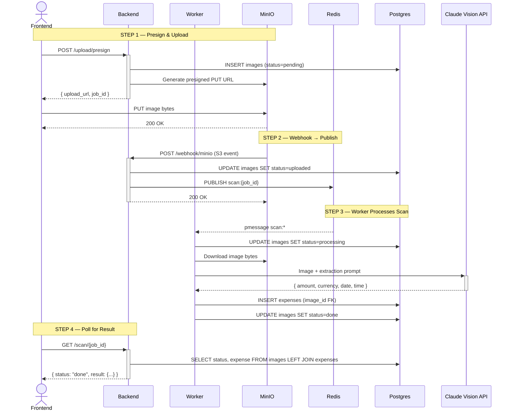

# หมาจด / WoofJot

บันทึกค่าใช้จ่ายจากสลิปธนาคารไทย ด้วย Claude Vision AI

Scan Thai bank transfer slips and automatically extract amount, date, and time using Claude Vision. Everything runs locally with a single command.

## Demo flow

1. Upload a Thai bank slip (KBank, SCB, KTB, BBL, TTB, PromptPay)
2. Claude Vision extracts amount, date, and time automatically
3. Tag each expense with a category and note
4. View monthly totals and category breakdown

## Stack

| Layer | Technology |
|---|---|
| Frontend | Next.js 14 (App Router) |
| Backend | FastAPI (Python 3.11) |
| AI | Claude Vision API (`claude-opus-4-5`) |
| Blob storage | MinIO (S3-compatible) |
| Event bus | Redis pub/sub |
| Database | PostgreSQL 16 |
| Runtime | Docker Compose |

No external services — everything runs locally.

## How it works



The frontend uploads directly to MinIO via a presigned URL — the backend never touches the image bytes. MinIO fires a webhook to the backend, which publishes to Redis. An async worker subscribes, calls Claude, and writes results to Postgres. The frontend polls until done.

## Quick start

**Prerequisites:** Docker, Docker Compose, an [Anthropic API key](https://console.anthropic.com/)

```bash
git clone https://github.com/your-username/woofjot.git
cd woofjot

cp .env.example .env
# Edit .env and set your ANTHROPIC_API_KEY

docker compose up --build
```

| Service | URL |
|---|---|
| App | http://localhost:3000 |
| API docs | http://localhost:8000/docs |
| MinIO console | http://localhost:9001 (minioadmin / minioadmin) |

## API

| Method | Path | Description |
|---|---|---|
| `POST` | `/upload/presign` | Get presigned PUT URL + job_id |
| `POST` | `/webhook/minio` | MinIO S3 event receiver |
| `GET` | `/scan/{job_id}` | Poll scan status |
| `GET` | `/expenses` | List all expenses |
| `PATCH` | `/expenses/{id}` | Update category / note |
| `DELETE` | `/expenses/{id}` | Delete expense and slip |
| `GET` | `/health` | Health check |

## Expense categories

| Key | ภาษาไทย |
|---|---|
| `food` | อาหาร |
| `transport` | เดินทาง |
| `shopping` | ช้อปปิ้ง |
| `utilities` | ค่าน้ำค่าไฟ |
| `health` | สุขภาพ |
| `entertainment` | บันเทิง |
| `other` | อื่นๆ |

## Supported banks

KBank · SCB · KTB · BBL · TTB · PromptPay QR

Dates in Buddhist Era (e.g. พ.ศ. 2568) are automatically converted to CE.

## Project structure

```
├── frontend/          # Next.js 14 app
│   ├── app/
│   ├── components/
│   │   ├── SlipUploader.tsx
│   │   ├── ScanStatus.tsx
│   │   ├── ExpenseList.tsx
│   │   └── MonthlySummary.tsx
│   └── lib/
├── backend/           # FastAPI app + async worker
│   ├── routers/
│   ├── services/
│   │   ├── claude.py  # Vision extraction
│   │   ├── db.py      # asyncpg queries
│   │   ├── pubsub.py  # Redis pub/sub
│   │   └── storage.py # MinIO client
│   └── main.py
├── docker-compose.yml
└── .env.example
```

## License

MIT
