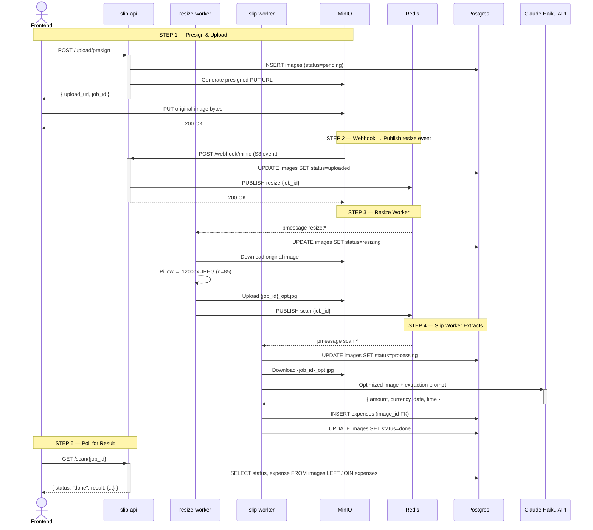

# หมาจด / WoofJot

บันทึกค่าใช้จ่ายจากสลิปธนาคารไทย ด้วย Claude Vision AI

Scan Thai bank transfer slips and automatically extract amount, date, and time using Claude Vision. Everything runs locally with a single command.

## Demo flow

1. Upload a Thai bank slip (KBank, SCB, KTB, BBL, TTB, PromptPay)
2. Claude Vision extracts amount, date, and time automatically
3. Tag each expense with a category and note
4. View monthly totals and category breakdown

## Stack

| Layer | Technology |
|---|---|
| Frontend | Next.js 14 (App Router) |
| slip-api | FastAPI (Python 3.11) — presign, webhook, scan poll |
| expenses-api | FastAPI (Python 3.11) — expense CRUD |
| resize-worker | Python async — Pillow resize → MinIO |
| slip-worker | Python async — Claude Vision extraction |
| AI | Claude Vision API (`claude-haiku-4-5`) |
| Blob storage | MinIO (S3-compatible) |
| Event bus | Redis pub/sub |
| Database | PostgreSQL 16 |
| Runtime | Docker Compose |

No external services — everything runs locally.

## How it works



The frontend uploads the original image directly to MinIO via a presigned URL. MinIO fires a webhook to slip-api, which publishes to Redis. The resize-worker downloads the original, produces a 1200px JPEG, and publishes to the scan channel. The slip-worker downloads the optimized image, calls Claude Haiku, and writes results to Postgres. The frontend polls until done. The original image is preserved in MinIO for display in the UI.

## Quick start

**Prerequisites:** Docker, Docker Compose, an [Anthropic API key](https://console.anthropic.com/)

```bash
git clone https://github.com/your-username/woofjot.git
cd woofjot

cp .env.example .env
# Edit .env and set your ANTHROPIC_API_KEY

docker compose up --build
```

| Service | URL |
|---|---|
| App | http://localhost:3000 |
| slip-api docs | http://localhost:8000/docs |
| expenses-api docs | http://localhost:8001/docs |
| MinIO console | http://localhost:9001 (minioadmin / minioadmin) |

## API

**slip-api** `localhost:8000`

| Method | Path | Description |
|---|---|---|
| `POST` | `/upload/presign` | Get presigned PUT URL + job_id |
| `POST` | `/webhook/minio` | MinIO S3 event receiver |
| `GET` | `/scan/{job_id}` | Poll scan status |
| `GET` | `/health` | Health check |

**expenses-api** `localhost:8001`

| Method | Path | Description |
|---|---|---|
| `GET` | `/expenses` | List all expenses |
| `PATCH` | `/expenses/{id}` | Update category / note |
| `DELETE` | `/expenses/{id}` | Delete expense and slip |
| `GET` | `/health` | Health check |

## Expense categories

| Key | ภาษาไทย |
|---|---|
| `food` | อาหาร |
| `transport` | เดินทาง |
| `shopping` | ช้อปปิ้ง |
| `utilities` | ค่าน้ำค่าไฟ |
| `health` | สุขภาพ |
| `entertainment` | บันเทิง |
| `other` | อื่นๆ |

## Supported banks

KBank · SCB · KTB · BBL · TTB · PromptPay QR

Dates in Buddhist Era (e.g. พ.ศ. 2568) are automatically converted to CE.

## Project structure

```
├── frontend/                  # Next.js 14 app
│   ├── app/
│   ├── components/
│   │   ├── SlipUploader.tsx
│   │   ├── ScanStatus.tsx
│   │   ├── ExpenseList.tsx
│   │   └── MonthlySummary.tsx
│   └── lib/
├── backend/
│   ├── sync/
│   │   ├── slip/              # slip-api  (port 8000)
│   │   │   ├── routers/       # upload, webhook, scan
│   │   │   ├── db.py
│   │   │   ├── storage.py
│   │   │   ├── pubsub.py
│   │   │   └── main.py
│   │   └── expenses/          # expenses-api  (port 8001)
│   │       ├── db.py
│   │       └── main.py
│   └── async/
│       ├── resize/            # resize-worker
│       │   ├── resizer.py     # Pillow resize logic
│       │   ├── storage.py
│       │   ├── pubsub.py
│       │   └── worker.py
│       └── slip/              # slip-worker
│           ├── claude.py      # Claude Haiku extraction
│           ├── storage.py
│           ├── pubsub.py
│           └── worker.py
├── docker-compose.yml
└── .env.example
```

## License

MIT
