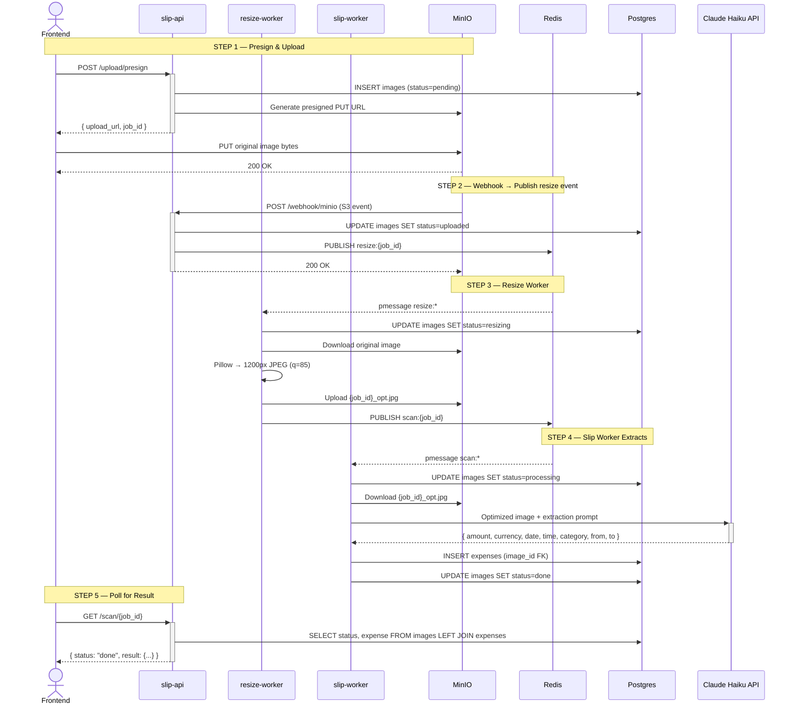

# หมาจด / WoofJot

บันทึกค่าใช้จ่ายจากสลิปธนาคารไทย ด้วย Claude Vision AI

Scan Thai bank transfer slips and automatically extract amount, date, time, category, sender, and receiver using Claude Vision. Everything runs locally with a single Docker Compose command.

## Features

- Upload a Thai bank slip (KBank, SCB, KTB, BBL, TTB, PromptPay)
- Claude Vision extracts amount, date, time, category, sender, and receiver automatically
- Image is auto-resized before sending to Claude to reduce API cost
- Tap any expense to expand — view slip details, edit extracted data, or delete
- Tap the slip thumbnail to view the original image in a lightbox
- Monthly view with category donut chart and per-category breakdown
- Navigate between months with the month selector

## Stack

| Layer | Technology |
|---|---|
| Frontend | Next.js 14 (App Router), Tailwind CSS |
| slip-api | FastAPI (Python 3.11) — presign, webhook, scan poll |
| expenses-api | FastAPI (Python 3.11) — expense CRUD |
| resize-worker | Python async — Pillow resize → MinIO → Redis |
| slip-worker | Python async — Claude Vision extraction → Postgres |
| AI | Anthropic Claude Haiku (`claude-haiku-4-5-20251001`) |
| Blob storage | MinIO (S3-compatible) |
| Event bus | Redis pub/sub |
| Database | PostgreSQL 16 |
| Runtime | Docker Compose |

No external services — everything runs locally with one command.

## How it works



The frontend uploads the original image directly to MinIO via a presigned URL. MinIO fires a webhook to slip-api, which publishes a resize event to Redis. The resize-worker downloads the original, produces a 1200px JPEG, and publishes to the scan channel. The slip-worker downloads the optimized image, calls Claude Haiku with the extraction prompt, and writes the result to Postgres. The frontend polls until done. The original image is preserved in MinIO for display in the UI.

## Quick start

**Prerequisites:** Docker, Docker Compose, an [Anthropic API key](https://console.anthropic.com/)

```bash
git clone https://github.com/your-username/woofjot.git
cd woofjot

cp .env.example .env
# Edit .env — set ANTHROPIC_API_KEY (everything else has working defaults)

docker compose up --build
```

| Service | URL |
|---|---|
| App | http://localhost:3000 |
| slip-api docs | http://localhost:8000/docs |
| expenses-api docs | http://localhost:8001/docs |
| MinIO console | http://localhost:9001 (minioadmin / minioadmin) |

## Environment variables

Key variables in `.env` (see `.env.example` for full list):

| Variable | Description |
|---|---|
| `ANTHROPIC_API_KEY` | Required. Your Anthropic API key. |
| `CLAUDE_MODEL` | Claude model ID. Default: `claude-haiku-4-5-20251001` |
| `RESIZE_MAX_PX` | Max image dimension before Claude call. Default: `1200` |
| `RESIZE_QUALITY` | JPEG quality for resized image. Default: `85` |
| `MINIO_EXTERNAL_ENDPOINT` | MinIO endpoint reachable by the browser. Default: `localhost:9000` |

## API

**slip-api** `localhost:8000`

| Method | Path | Description |
|---|---|---|
| `POST` | `/upload/presign` | Get presigned PUT URL + job_id |
| `POST` | `/webhook/minio` | MinIO S3 event receiver |
| `GET` | `/scan/{job_id}` | Poll scan status and result |
| `GET` | `/health` | Health check |

**expenses-api** `localhost:8001`

| Method | Path | Description |
|---|---|---|
| `GET` | `/expenses` | List all expenses (joined with image URL) |
| `PATCH` | `/expenses/{id}` | Update any extracted field or category/note |
| `DELETE` | `/expenses/{id}` | Delete expense and original slip image |
| `GET` | `/health` | Health check |

### PATCH /expenses/{id} body

All fields are optional. Only provided fields are updated.

```json
{
  "amount": 466.00,
  "date": "2026-04-07",
  "time": "22:24:00",
  "sender": "Suphachai P.",
  "receiver": "Coffee Shop Co., Ltd.",
  "category": "food",
  "note": "lunch"
}
```

## Expense categories

| Key | ภาษาไทย |
|---|---|
| `food` | อาหาร |
| `transport` | เดินทาง |
| `shopping` | ช้อปปิ้ง |
| `utilities` | ค่าน้ำค่าไฟ |
| `health` | สุขภาพ |
| `entertainment` | บันเทิง |
| `invest` | ลงทุน |
| `other` | อื่นๆ |

Category is inferred by Claude from the merchant name or description on the slip. Users can correct it in the app.

## Supported banks

KBank (กสิกรไทย) · SCB (ไทยพาณิชย์) · KTB (กรุงไทย) · BBL (กรุงเทพ) · TTB (ทหารไทยธนชาต) · PromptPay QR

Dates in Buddhist Era (e.g. พ.ศ. 2568) are automatically converted to CE.

## Project structure

```
├── frontend/
│   ├── app/
│   │   ├── page.tsx               # Main page — month nav, totals, expense list
│   │   └── layout.tsx
│   ├── components/
│   │   ├── SlipUploader.tsx       # File picker → presign → PUT → poll
│   │   ├── ScanStatus.tsx         # Polling progress indicator
│   │   ├── ExpenseList.tsx        # Grouped list with tap-to-expand rows
│   │   ├── MonthlySummary.tsx     # Donut chart + category breakdown
│   │   └── DonutChart.tsx         # Pure SVG donut (no chart library)
│   └── lib/
│       ├── api.ts                 # All fetch calls to both backends
│       └── types.ts               # Shared TypeScript interfaces
├── backend/
│   ├── sync/
│   │   ├── slip/                  # slip-api  (port 8000)
│   │   │   ├── routers/
│   │   │   │   ├── upload.py      # POST /upload/presign
│   │   │   │   ├── webhook.py     # POST /webhook/minio
│   │   │   │   └── scan.py        # GET /scan/{job_id}
│   │   │   ├── db.py
│   │   │   ├── storage.py
│   │   │   ├── pubsub.py
│   │   │   └── main.py
│   │   └── expenses/              # expenses-api  (port 8001)
│   │       ├── db.py
│   │       ├── models.py
│   │       └── main.py
│   └── async/
│       ├── resize/                # resize-worker
│       │   ├── resizer.py         # Pillow resize logic
│       │   ├── storage.py
│       │   ├── pubsub.py
│       │   └── worker.py
│       └── slip/                  # slip-worker
│           ├── claude.py          # Claude Haiku extraction prompt + logic
│           ├── storage.py
│           ├── pubsub.py
│           └── worker.py
├── docker-compose.yml
├── .env.example
└── CLAUDE.md                      # Architecture reference for AI assistants
```

## Design decisions

- **No shared files across services.** Each service owns its own `db.py`, `config.py`, `storage.py` scoped to only what it needs.
- **Redis is pub/sub only.** No `GET`/`SET` — all state lives in Postgres.
- **Single source of truth.** `images.status` drives the entire scan lifecycle.
- **Image is resized before Claude.** Reduces token cost without sacrificing extraction accuracy.
- **Original image preserved.** The browser always shows the original; only the optimized copy is sent to Claude.

## License

MIT
