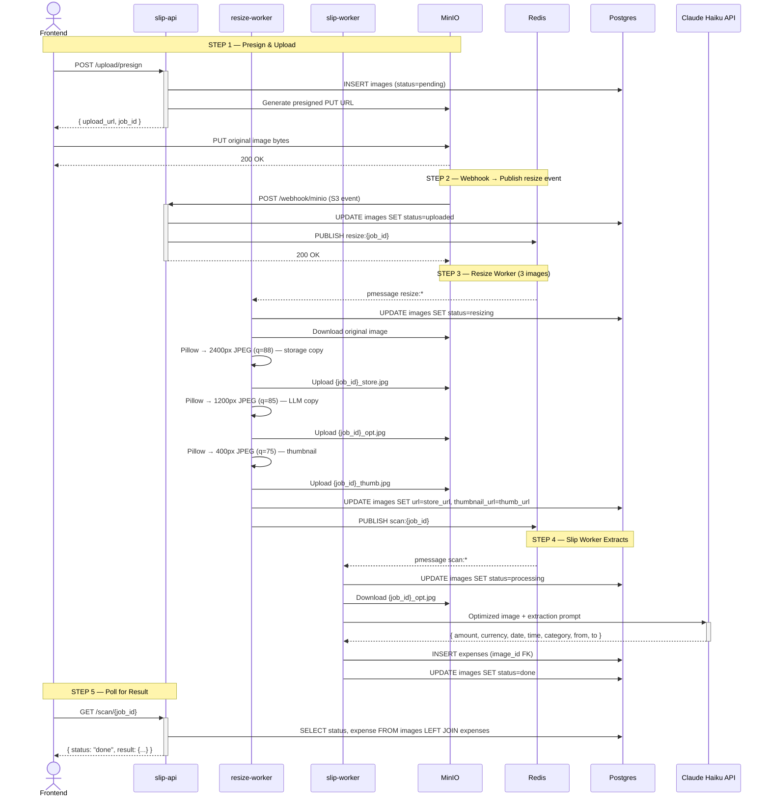

# หมาจด / WoofJot

บันทึกค่าใช้จ่ายจากสลิปธนาคารไทย ด้วย Claude Vision AI

Scan Thai bank transfer slips and automatically extract amount, date, time, category, sender, and receiver using Claude Vision. Everything runs locally with a single Docker Compose command.

## Features

- Upload up to 10 Thai bank slips at once (KBank, SCB, KTB, BBL, TTB, PromptPay)
- Claude Vision extracts amount, date, time, category, sender, and receiver automatically
- Non-slip images (photos, screenshots, etc.) are detected and rejected with a clear error
- Each upload produces 3 images: storage copy (2400px), LLM copy (1200px for Claude), thumbnail (400px for fast UI)
- Manual income/expense entry without a slip — add cash payments, transfers, or any expense directly
- Tap any expense to expand — view slip details or manual entry placeholder, edit data, or delete
- Tap the slip thumbnail to view the full image inline
- Monthly view with category donut chart and per-category breakdown (aggregated in SQL)
- Navigate between months with the month selector
- Sort expenses by slip date or upload date — preference persisted across sessions
- Skeleton loading states for header totals, category summary, and expense list
- Switch between Thai and English — language preference persisted across sessions

## Stack

| Layer | Technology |
|---|---|
| Frontend | Next.js 14 (App Router), Tailwind CSS |
| slip-api | FastAPI (Python 3.11) — presign, webhook, scan poll |
| expenses-api | FastAPI (Python 3.11) — expense CRUD |
| resize-worker | Python async — Pillow resize → MinIO → Redis |
| slip-worker | Python async — Claude Vision extraction → Postgres |
| AI | Anthropic Claude Haiku (`claude-haiku-4-5-20251001`) |
| Blob storage | MinIO (S3-compatible) |
| Event bus | Redis pub/sub |
| Database | PostgreSQL 16 |
| Runtime | Docker Compose |

No external services — everything runs locally with one command.

## How it works



The frontend uploads the original image directly to MinIO via a presigned URL. MinIO fires a webhook to slip-api, which publishes a resize event to Redis. The resize-worker downloads the original and produces three images: a high-quality storage copy (`_store.jpg`, 2400px), an LLM-optimized copy (`_opt.jpg`, 1200px), and a thumbnail (`_thumb.jpg`, 400px). It updates `images.url` and `images.thumbnail_url` in Postgres, then publishes to the scan channel. The slip-worker downloads the optimized copy, calls Claude Haiku with the extraction prompt, and writes the result to Postgres. The frontend polls until done and displays the thumbnail in the expense list.

## Quick start

**Prerequisites:** Docker, Docker Compose, an [Anthropic API key](https://console.anthropic.com/)

```bash
git clone https://github.com/your-username/woofjot.git
cd woofjot

cp .env.example .env
# Edit .env — set ANTHROPIC_API_KEY (everything else has working defaults)

docker compose up --build
```

| Service | URL |
|---|---|
| App | http://localhost:3000 |
| slip-api docs | http://localhost:8000/docs |
| expenses-api docs | http://localhost:8001/docs |
| MinIO console | http://localhost:9001 (minioadmin / minioadmin) |

## Environment variables

Key variables in `.env` (see `.env.example` for full list):

| Variable | Description |
|---|---|
| `ANTHROPIC_API_KEY` | Required. Your Anthropic API key. |
| `CLAUDE_MODEL` | Claude model ID. Default: `claude-haiku-4-5-20251001` |
| `RESIZE_MAX_PX` | LLM-optimised copy max dimension. Default: `1200` |
| `RESIZE_QUALITY` | LLM-optimised copy JPEG quality. Default: `85` |
| `RESIZE_STORE_MAX_PX` | Storage copy max dimension. Default: `2400` |
| `RESIZE_STORE_QUALITY` | Storage copy JPEG quality. Default: `88` |
| `RESIZE_THUMB_MAX_PX` | Thumbnail max dimension. Default: `400` |
| `RESIZE_THUMB_QUALITY` | Thumbnail JPEG quality. Default: `75` |
| `MINIO_EXTERNAL_ENDPOINT` | MinIO endpoint reachable by the browser. Default: `localhost:9000` |

## API

**slip-api** `localhost:8000`

| Method | Path | Description |
|---|---|---|
| `POST` | `/upload/presign` | Get presigned PUT URL + job_id |
| `POST` | `/webhook/minio` | MinIO S3 event receiver |
| `GET` | `/scan/{job_id}` | Poll scan status and result |
| `GET` | `/health` | Health check |

**expenses-api** `localhost:8001`

| Method | Path | Description |
|---|---|---|
| `GET` | `/expenses?month=YYYY-MM&sort=date\|uploaded` | List expenses + category summary for a month |
| `POST` | `/expenses` | Create a manual expense (no slip required) |
| `PATCH` | `/expenses/{id}` | Update any extracted field or category/note |
| `DELETE` | `/expenses/{id}` | Delete expense (and slip image if attached) |
| `GET` | `/health` | Health check |

`GET /expenses` returns `{ expenses, summary }`. `sort=date` (default) filters and orders by slip date; `sort=uploaded` by upload timestamp. All filtering and category aggregation happen in SQL — the frontend renders the response directly without further processing.

### PATCH /expenses/{id} body

All fields are optional. Only provided fields are updated.

```json
{
  "amount": 466.00,
  "date": "2026-04-07",
  "time": "22:24:00",
  "sender": "Suphachai P.",
  "receiver": "Coffee Shop Co., Ltd.",
  "category": "food",
  "note": "lunch"
}
```

## Expense categories

| Key | ภาษาไทย |
|---|---|
| `food` | อาหาร |
| `transport` | เดินทาง |
| `shopping` | ช้อปปิ้ง |
| `utilities` | ค่าน้ำค่าไฟ |
| `health` | สุขภาพ |
| `entertainment` | บันเทิง |
| `invest` | ลงทุน |
| `other` | อื่นๆ |

Category is inferred by Claude from the merchant name or description on the slip. Users can correct it in the app.

## Supported banks

KBank (กสิกรไทย) · SCB (ไทยพาณิชย์) · KTB (กรุงไทย) · BBL (กรุงเทพ) · TTB (ทหารไทยธนชาต) · PromptPay QR

Dates in Buddhist Era (e.g. พ.ศ. 2568) are automatically converted to CE.

## Project structure

```
├── frontend/
│   ├── app/
│   │   ├── page.tsx               # Main page — month nav, totals, expense list
│   │   └── layout.tsx
│   ├── components/
│   │   ├── SlipUploader.tsx       # File picker → presign → PUT → poll (up to 10)
│   │   ├── ScanStatus.tsx         # Polling progress indicator
│   │   ├── ExpenseList.tsx        # Grouped list with tap-to-expand rows
│   │   ├── ManualEntryForm.tsx    # Manual income/expense entry form
│   │   ├── MonthlySummary.tsx     # Donut chart + category breakdown
│   │   └── DonutChart.tsx         # Pure SVG donut (no chart library)
│   └── lib/
│       ├── api.ts                 # All fetch calls to both backends
│       ├── types.ts               # Shared TypeScript interfaces
│       ├── i18n.tsx               # I18nProvider, useI18n hook
│       └── locales/
│           ├── th.ts              # Thai strings
│           └── en.ts              # English strings
├── backend/
│   ├── sync/
│   │   ├── slip/                  # slip-api  (port 8000)
│   │   │   ├── routers/
│   │   │   │   ├── upload.py      # POST /upload/presign
│   │   │   │   ├── webhook.py     # POST /webhook/minio
│   │   │   │   └── scan.py        # GET /scan/{job_id}
│   │   │   ├── db.py
│   │   │   ├── storage.py
│   │   │   ├── pubsub.py
│   │   │   └── main.py
│   │   └── expenses/              # expenses-api  (port 8001)
│   │       ├── db.py
│   │       ├── models.py
│   │       └── main.py
│   └── async/
│       ├── resize/                # resize-worker
│       │   ├── resizer.py         # Pillow resize logic
│       │   ├── storage.py
│       │   ├── pubsub.py
│       │   └── worker.py
│       └── slip/                  # slip-worker
│           ├── claude.py          # Claude Haiku extraction prompt + logic
│           ├── storage.py
│           ├── pubsub.py
│           └── worker.py
├── docker-compose.yml
├── .env.example
└── CLAUDE.md                      # Architecture reference for AI assistants
```

## Design decisions

- **No shared files across services.** Each service owns its own `db.py`, `config.py`, `storage.py` scoped to only what it needs.
- **Redis is pub/sub only.** No `GET`/`SET` — all state lives in Postgres.
- **Single source of truth.** `images.status` drives the entire scan lifecycle.
- **Three images per upload.** `_store.jpg` (2400px) for high-quality display, `_opt.jpg` (1200px) for Claude to reduce token cost, `_thumb.jpg` (400px) for fast thumbnail rendering in the expense list.
- **`images.url` updated after resize.** Initially points to the raw upload; resize-worker overwrites it with the storage copy URL so the UI always shows the compressed-but-high-quality version.
- **Non-slip detection in the prompt.** Claude is instructed to return `{"not_a_slip": true}` when the image is not a bank transfer slip. The worker detects this sentinel and stores a Thai-language error message (`ไม่พบสลิปธนาคารในภาพนี้`) rather than a raw exception string.
- **Month filtering, sort, and category aggregation in SQL.** `GET /expenses` returns `{ expenses, summary }` in one query. The frontend never re-aggregates — it renders `summary` as-is.
- **Manual entries coexist with slip-backed entries.** `expenses.image_id` is nullable. `GET /expenses` uses `LEFT JOIN images` so both types appear. `DELETE` checks `image_id` first — if set it cascades via the image row; if null it deletes the expense row directly.
- **Zero-dependency i18n.** All UI strings live in `lib/locales/th.ts` and `lib/locales/en.ts`. A React Context (`useI18n`) serves the active locale; `localStorage` persists the preference. No i18n library needed.

## License

MIT
